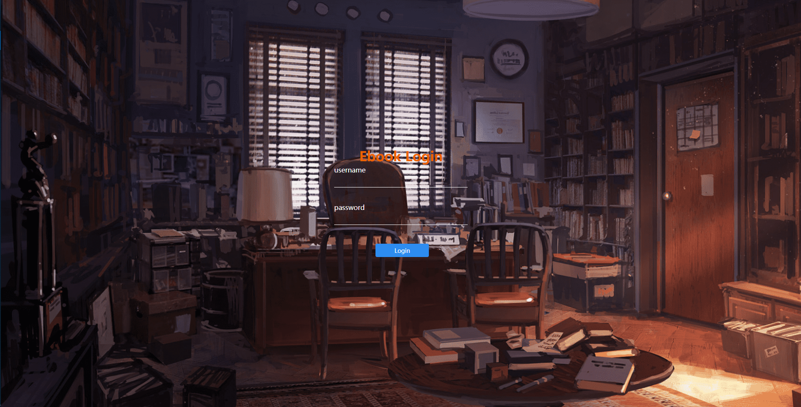
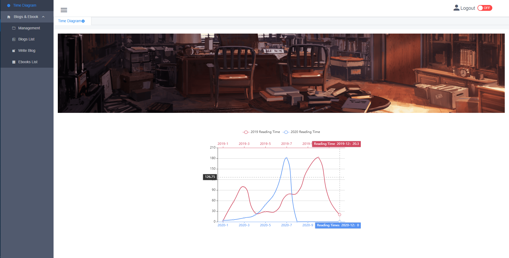
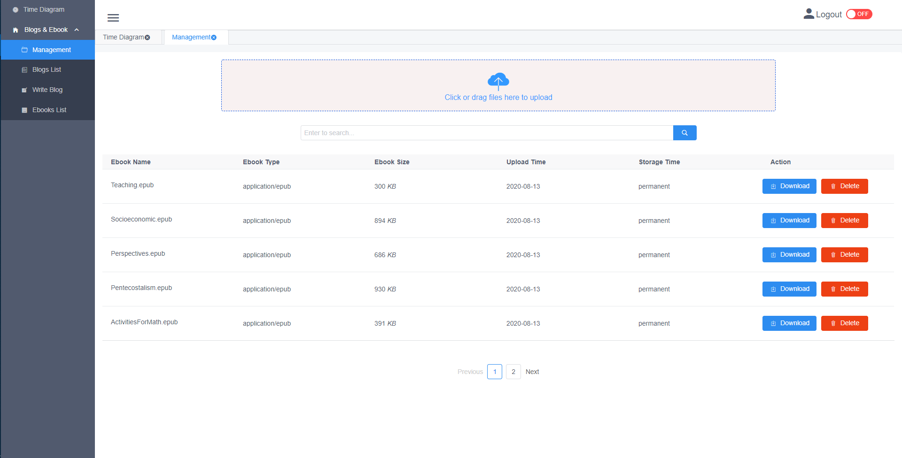
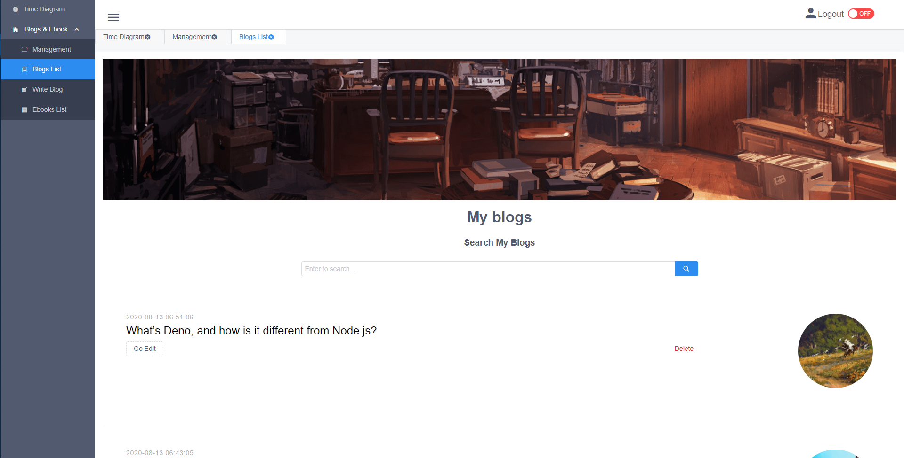
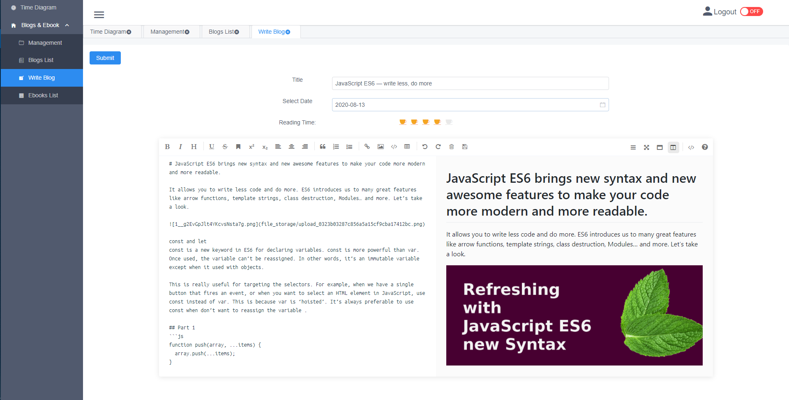
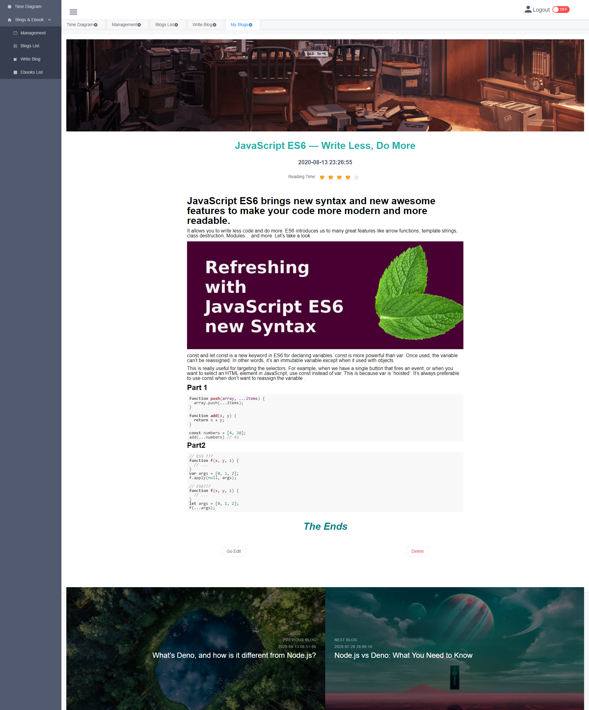
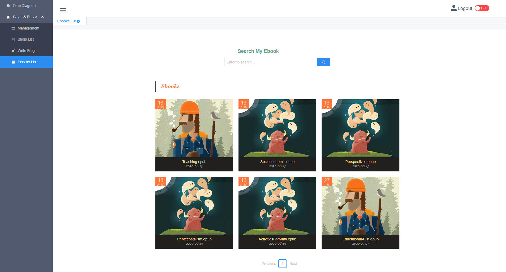
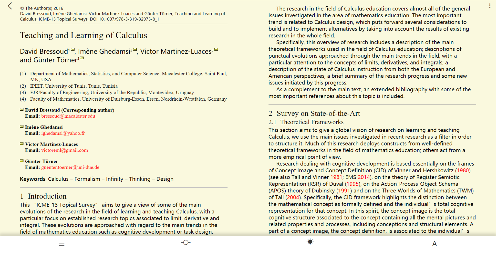

# Ebooks and Blogs Reader
**Preview Address:** https://fleetingsound.net  (Id: <u>jake</u> , password: <u>JaKe!cA1i</u>)

Or

**Demo Video:** https://youtu.be/uZa1vrp_Xjg

## Functions

The theme of this project is E-book reading  and blog publishing. 

The functions include:

- Upload and manage E-books(epub format ). 
- Record feelings after reading Ebooks, write blogs, update and delete them in blog list.
- The blog part uses markdown editor, with rich functions, users can freely write blogs.
- In the e-book part, users can adjust the background color and read progress, browse the book catalog, adjust the font size, etc.
- Users can use the slider to quickly switch pages like using  browser.

## Stack

Front End:   Vue + Vuex + iviewUI+ Epub.js + mavonEditor

Server:   Express + Sequelize + Redis 

Database:   MySQL

Deployment:  AWS + Nginx + Node + MySQL 


## Installation & Operation

1. Server side install packages:

   ```js
   npm install 
   npm run dev
   ```

2. Front End  side install packages:

   ```js
   npm install
   npm run serve
   ```

3. Configure MySQL information.(admin info and port)

To ensure correct operation, please run the backend service first, and then run the front end again, then visit http://localhost:8080


## Performance Optimization

- Compress`js`、`css`, `images`
- Using`gzip` 


## ScreenShots

**1 Login Page**




**2. Home Page**




**3.Ebooks Management**




**4.Blogs List**




**5,Write Blog**




**6.Read Blog**




**7.Ebooks List**




**8.Read Ebooks**




